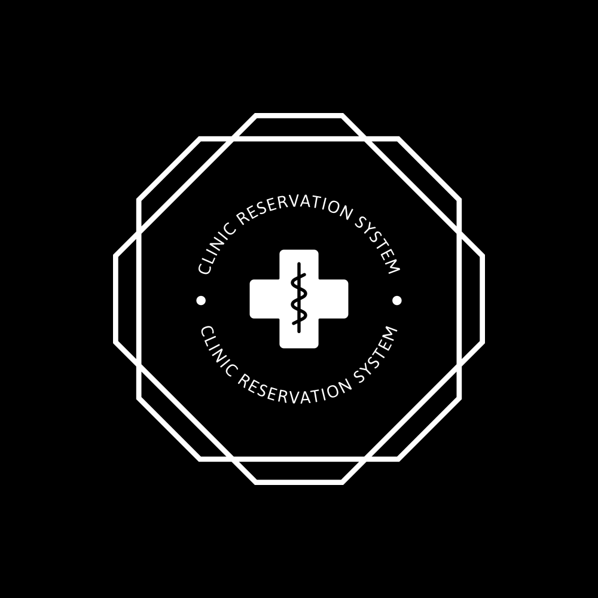

<!-- PROJECT SHIELDS -->

[![Contributors][contributors-shield]][contributors-url] [![Stargazers][stars-shield]][stars-url] [![Issues][issues-shield]][issues-url] [![Issues][issues-shield]][issues-url] [![MIT License][license-shield]][license-url]

<!-- PROJECT LOGO -->
 

  

<h3 align="center">Clinic Reservation System</h3>

  

    A CLI-based reservation system to manage booking appointments
     
    <a href="https://github.com/greydelta/clinic-reservation-system"><strong>Explore the docs »</strong></a>
     
     
    <a href="https://github.com/greydelta/clinic-reservation-system">View Demo</a>
    ·
    <a href="https://github.com/greydelta/clinic-reservation-system/issues">Report Bug</a>
    ·
    <a href="https://github.com/greydelta/clinic-reservation-system/issues">Request Feature</a>
  

<!-- ABOUT THE PROJECT -->

## About The Project

### Program behaviour:

1. Key Features of the system:

- Only Staff and Doctor will be able to use the system
- Staff will help patient:
  > - Create patient profile
  > - Create / update booking

2. Staff has more access control than the doctor since doctor just needs to view patient record and information

3. There are 3 different status for an appointment: ("Booked"/"Cancelled"/"Consulted")

4. A patient can only have 1 active appointment ("Booked") at any one time

   > - if patient has at least 1 booking with status = "Booked"
   > - then they are restricted from creating a new booking
   > - unless the booking is updated to "Cancelled" or "Booked"
   > - **Note:** Staff can update "Cancelled" to "Booked"/"Consulted"

5. During creation of New Patient Profile, the program will check if it matches an existing profile where:

   > `if name && contact != same`
   >
   > > Proceed to Create New Profile

   > `else if name && contact == same`
   >
   > > Prompt Profile Exist!

   > **Note:** Implies that 2 patients can have the same name but not the same number

6. Update Patient Profile feature only for **name/contact**
7. Update Appointment feature only for **status/date/time** (not allowed to change doctor)
8. Update Appointment Logic:

- **Scenario 1: Patient HAS existing booking**

  > `if(selectedBooking == "Booked")`
  >
  > > ❌ Not Allowed to: Update "Booked" to "Booked"

  > > ✔ Allowed to: Update "Booked" to "Cancelled"/"Consulted"

  > `else if(selectedBooking != "Booked")`
  >
  > > ❌ Not Allowed to: Update "Cancelled"/"Consulted" to "Booked"

  > > ✔ Allowed to: Update "Cancelled"/"Consulted" to "Cancelled"/"Consulted"

- **Scenario 2: Patient has NO existing booking**

  > > ✔ Allowed to: Update "Cancelled"/"Consulted" to "Booked"

  > > ✔ Allowed to: Update "Cancelled"/"Consulted" to "Cancelled"/"Consulted"

7. Since this is a runtime only application, logging in as doctor, will only display those appointments that are in the `appointment.txt` file. However, any appointment added during runtime will also be included in the core functionalities of all the functions and would be expected to behave accordingly.

8. Almost all functions require the input of Patient's Name and Contact number before proceeding to perform the selected function.

9. All login credentials/existing patients/existing bookings can be viewed in their respective `.txt` files.

(<a href="#top">back to top</a>)

### Sample Output

[![video demo][media-video]](#)

(<a href="#top">back to top</a>)

### Built With

(<a href="#top">back to top</a>)

<!-- GETTING STARTED -->

## Getting Started

## Using  :

#### Prerequisites

- Install [Extension Pack for Java](https://marketplace.visualstudio.com/items?itemName=vscjava.vscode-java-pack)

#### Installation

- Import Project Folder in VS Code

#### Usage

1. Right click on `App.java`

1. Click "Run Java"

(<a href="#top">back to top</a>)

## Using  :

#### Prerequisites

- Download & install [JRE-15](https://www.oracle.com/java/technologies/javase/jdk15-archive-downloads.html) and above according to your OS

#### Installation

1. Import Project Folder in Eclipse IDE

1. Right click on Project Folder in Project Folder View

1. Click "Build Path"

1. Click "Configure Build Path"

1. Under the "Libraries" Tab, click JRE System Library

1. Click "Edit"

1. Under "Execution Environment", choose "JavaSE-15 (jre)" from the dropdown

1. Click "Finish" then "Apply and Close"

### Usage

1. Right click on Project Folder in Project Folder View

1. Click "Run As"

1. Click "Java Application"

(<a href="#top">back to top</a>)

<!-- CONTRIBUTING -->

## Contributing

Contributions are what make the open source community such an amazing place to learn, inspire, and create. Any contributions you make are **greatly appreciated**.

If you have a suggestion that would make this better, please fork the repo and create a pull request. You can also simply open an issue with the tag "enhancement". Don't forget to give the project a star! Thanks again!

1. Fork the Project
2. Create your Feature Branch (`git checkout -b feature/AmazingFeature`)
3. Commit your Changes (`git commit -m 'Add some AmazingFeature'`)
4. Push to the Branch (`git push origin feature/AmazingFeature`)
5. Open a Pull Request

(<a href="#top">back to top</a>)

<!-- LICENSE -->

## License

Distributed under the MIT License. See `LICENSE.txt` for more information.

(<a href="#top">back to top</a>)

<!-- CONTACT -->

## Contact

    

 

Project Link: [https://github.com/greydelta/clinic-reservation-system](https://github.com/greydelta/clinic-reservation-system)

(<a href="#top">back to top</a>)

<!-- ACKNOWLEDGMENTS -->

## Acknowledgments

(<a href="#top">back to top</a>)

<!-- MARKDOWN LINKS & IMAGES -->

[contributors-shield]: https://img.shields.io/github/contributors/greydelta/clinic-reservation-system.svg?style=for-the-badge
[contributors-url]: https://github.com/greydelta/clinic-reservation-system/graphs/contributors
[forks-shield]: https://img.shields.io/github/forks/greydelta/sclinic-reservation-system.svg?style=for-the-badge
[forks-url]: https://github.com/greydelta/clinic-reservation-system/network/members
[stars-shield]: https://img.shields.io/github/stars/greydelta/clinic-reservation-system.svg?style=for-the-badge
[stars-url]: https://github.com/greydelta/clinic-reservation-system/stargazers
[issues-shield]: https://img.shields.io/github/issues/greydelta/clinic-reservation-system.svg?style=for-the-badge
[issues-url]: https://github.com/greydelta/clinic-reservation-system/issues
[license-shield]: https://img.shields.io/github/license/greydelta/clinic-reservation-system.svg?style=for-the-badge
[license-url]: https://github.com/greydelta/clinic-reservation-system/blob/master/LICENSE.txt
[media-video]: resources/video.gif
